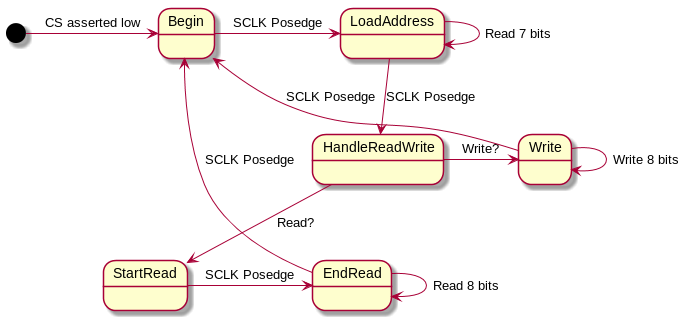

# Computer Architecture Lab 2: SPI Memory
### By Daniel Connolly, Kawin Nikomborirak, William Fairman, and Sreekanth Sajjala

## Midpoint
### Input Conditioning
In bringing an external signal onto an internal clock domain, we needed to utilize a pair of D flip-flops to synchronize the signal with the clock. This effectively brings the signal into phase with the internal domain. Moreover, we implemented a delay between the synchronized output of the second D flip flop and the conditioned output in order to avoid bouncing. As a result, when the second flip flop asserts a 1, the conditioned output only asserts a 1 on the fourth positive edge following this assertion. In other words, it waits for three positive edges of the clock. Finally, though it was not important for the function of the input conditioner, we created positive and negative edge signals that assert of the clock edges whenever the conditioned output changes in order to assist other subcircuits of the overall CPU in functioning properly.

#### Gate Schematic
The following diagram shows the structural layout of our input conditioner. The diagram consists of four main functions: meta-stabilizing, counting/debouncing, resetting, and outputting a signal. The noisy signal is sent through a set of d-flip-flops to lower the probability of a meta-stabilized signal: the # of flip flops can be expanded if the probability of meta-stabilizing is too high. The counter consists of a 2-bit adder with a mux resetting the output if the reset flag is triggered. If the counter value reaches 3, the input conditioner outputs a new conditioned signal and could trigger a posedge or negedge flag.  

In order to test our input conditioner, we mainly relied on the Gtkwave Analyzer. In analyzing the waveforms output by the analyzer, we looked for instances of bouncing in the noisy input signal. When these occurred, we carefully reviewed the conditioned output of the signal, which told us the circuit was working properly. It is important to note that for our wait-time of three clock cycles, which each cycle lasting twenty nanoseconds on the 50MHz clock, the longest input glitch that the conditioner can suppress is 79 nanoseconds, as this glitch would end just before the fourth clock cycle hit its positive edge. For a wait-time of ten clock cycles, then, the maximum length input glitch the input conditioner will suppress is 209 nanoseconds. To calculate this, simply multiply the wait-time in clock cycles, 10 for our purposes here, by the length of each clock cycle, 20 nanoseconds, and then add just less than one additional clock cycle to the result. The output of our input conditioner, functioning properly, is shown below.

### Shift Register

The shift register tests by loading 1s into the shift register memory and checking that the loading of 1s from the LSB has successfully occurs.
Then we check that 0 can be loaded into the shift register memory in a similar way, asserting the values of parallelDataOut as we shift 0s into the memory until the memory is just 0.
The initial set to 0 tests the use of parallelDataLoad, as if this step failed the above two steps will have also failed as they assume 0 has been loaded into the memory.
On failed cases, the check classification, actual, and expected values are printed to the console.
Since our tests were passed, nothing was printed to the console.
Of course, we checked that the test bench worked by breaking the parallelDataLoad functionality and making sure the appropriate messages were displayed.

### Zybo FPGA Testing
We set the input conditioner widths to 26 and waittime 50000000 to test debouncing as well.
This gives us 1 second to put in signal glitches and test the debouncer.
The plan is to load 1 into the serial, then pass 0 into the serial until it leaves the memory unit.
Then I will make all values 1 by loading 1 into the serial 8 times with a delay of more than 1 second and then hit reset to test reset.
I will do the same again, but this time loading 0 into the serial instead.
Then I will test debouncing by loading 1 into the serial and double flipping the switch.
The 1 should not shift.

- Cycle 1 through the memory: successfully after 8 shifts.
- Make all values 1: Successful.
- Reset (button): Successfully writes xA5.
- Make all values 0: Successful.
- Reset: Successfully writes xA5.
- Load 1 into LSB: Successful.
- Double Toggle: Successfully does not shift.

# SPI Implementation
We used the schematic below available in the lab prompt.

The finite state machine we used is outlined by the below diagram.
If CS is high at any point, all enables are low and returned to the initial point.

This design shows the steps necessary for the behavior of an SPI memory unit: CS is asserted low, a 7 bit address is loaded, the RW bit is received, and 8 bits of data is either read or written.
Since there are enables for the data memory write (dm_we), the address write (addr_we), the shiftregister parallel in (sr_we), and the buffer write (miso_buff), it made sense to us to have each state be some combination of these enables.
To begin receiving an address, we must first enable addr_we (the `Begin` state), with everything else set low.
To receive an address from here, simply wait 7 serial clock cycles to load the data into the address (the `LoadAddress` state).
Once this happens, the state machine transitions to a state which handles reading and writing (the `ReadWrite` state).
If the 8th bit is high (read operation), we load the shiftregister with the contents of the datamemory and begin reading by setting sr_we high (the `StartRead` state).
To continue the read operation, we enable miso_buff for 8 serial clock cycles (`EndRead` state) and then return to the beginning state.
To write, we enable dm_we for 8 serial clock cycles and then return to the beginning state.

# SPI Test Strategy
